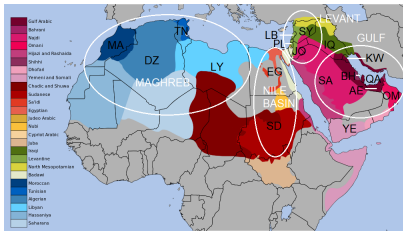

# Arabic-Dialect-Classification

  

This repository contains the code and resources for a project focused on classifying Arabic  tweets dialect. The aim of the project is to develop a machine learning model that can accurately classify tweets written in different Arabic dialects.

# Dataset
The dataset used for this project consists of a large collection of Arabic tweets, each labeled with the corresponding dialect. The tweets cover a wide range of topics and are written in various Arabic dialects, including but not limited to Egyptian, Libyan, Gulf, and Maghrebi dialects.

# Project Structure
The repository is organized as follows:

**data/**: This directory contains the dataset used for training and evaluation. It includes both the raw data and preprocessed versions, if applicable.

**notebooks/**: This directory contains Jupyter notebooks that provide step-by-step explanations of the data exploration, preprocessing, model training, and evaluation processes.

**models/**: This directory contains trained machine learning models for Arabic dialect tweets classification. It includes model files and associated resources.

**src/**: This directory contains the source code for the project, including data preprocessing scripts, model training scripts, and evaluation scripts.

**utils/**: This directory contains utility functions and helper scripts used throughout the project.

**deployment/**:This directory contains source code required for project deployment.

**requirements.txt**: This file lists the Python libraries and dependencies required to run the code in this repository.

# Getting Started
To get started with the project, follow these steps:

Clone the repository:

- git clone https://github.com/Aylore/Arabic-Dialect-Classification

Install the required dependencies. It is recommended to set up a virtual environment for this project:

- cd Arabic-Dialect-Classification
- pip install -r requirements.txt

Explore the notebooks/ directory to understand the project workflow and learn about the data preprocessing and model training processes.

Use the provided scripts in the src/ directory to preprocess new data, train new models, and evaluate their performance.

Use the pretrained model weights provided to finetune or classify immediately.

# Models Comparison
The table below compares the performance of different models trained and evaluated for Arabic dialect tweets classification:

In this project we used variety of models with different preprocessing techniques.

| Model         | F1_macro_val  | accuracy_val  |
| ------------- |:-------------:| -----:        |
|      ML       | 0.80          |    0.83 	|
|    Arabert    | 0.86          |    0.87  	|
|      RNN      | 0.81          |    0.84	|
|      GRU      | 0.83          |    0.86 	|
|      LSTM     | 0.83          |    0.86 	|

# Deployment

For deploying the Arabic Dialect Tweets Classification project, we utilized the Render platform in conjunction with FastAPI, a powerful web framework for building APIs with Python. Render simplifies the deployment process by providing an easy-to-use cloud platform, while FastAPI allows us to develop efficient and scalable API endpoints.

## Render

Render is a cloud platform designed to make deployment simple and hassle-free. It supports a wide range of applications and provides an intuitive interface for managing deployments. With Render, we were able to easily configure and deploy our Arabic Dialect Tweets Classification project.

## FastAPI

FastAPI is a modern, high-performance web framework for building APIs with Python. It offers numerous features, including automatic validation of request/response models, high performance powered by asynchronous capabilities, and automatic generation of interactive API documentation. FastAPI allowed us to develop a robust and efficient API for our project.

## Deployment Process

To deploy our Arabic Dialect Tweets Classification project, we followed these steps:

1. Configured a Render project: We created a new project on the Render platform and connected it to our GitHub repository containing the project code.

2. Set up the environment: We defined the necessary environment variables in the Render project settings. These variables included the port number and any other project-specific configurations.

3. Build and deploy the project: Render automatically triggered the deployment process whenever we pushed new code to the connected GitHub repository. The deployment process involved installing project dependencies, such as those specified in the `requirements_render.txt` file, and starting the FastAPI server.

4. Accessing the deployed project: Once the deployment was complete, Render provided us with a unique URL where the Arabic Dialect Tweets Classification project was accessible. You can access the deployed project [here]: https://arabic-dialect-classification-ai-mansoura.onrender.com/ 

The combination of Render and FastAPI made the deployment process efficient and reliable, allowing us to easily share our Arabic Dialect Tweets Classification project with others.

# Contributing
Contributions to this project are welcome.

